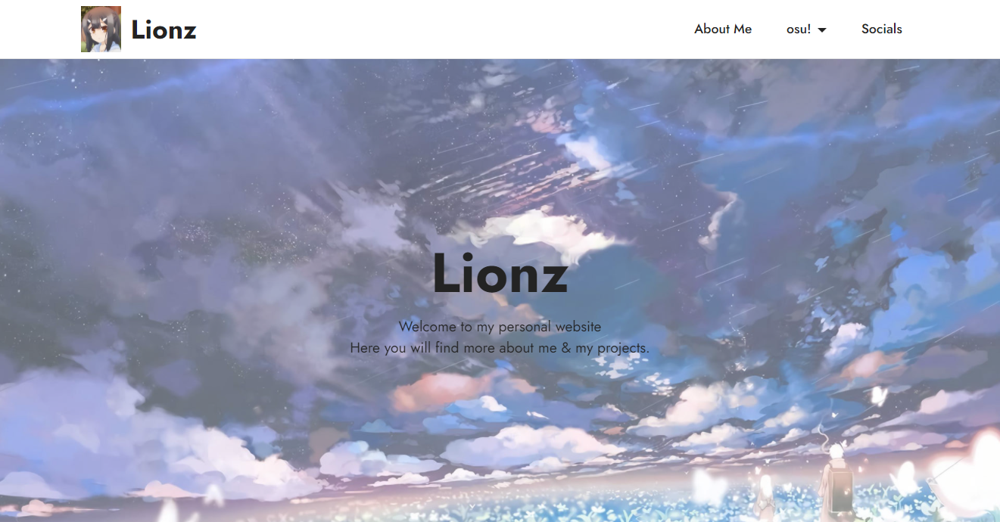

# lionz.moe
> Lionz's personal website

A very simple personal website, written in HTML.



## Installation

Either download or clone this repo and just drop into your public_html folder on your webhost/server.

```
```
## Release History

* 0.1.0
    * index.html finished
* 0.1.1
    * Added about-me.html
* 0.1.2
    * Added page2.html

## Meta

Lionz – [@poisenlion](https://twitter.com/poisenlion) – lionz@lionz.moe

Distributed under the XYZ license. See ``LICENSE`` for more information.

[https://github.com/Lionzv1/lionz.moe](https://github.com/Lionzv1)


